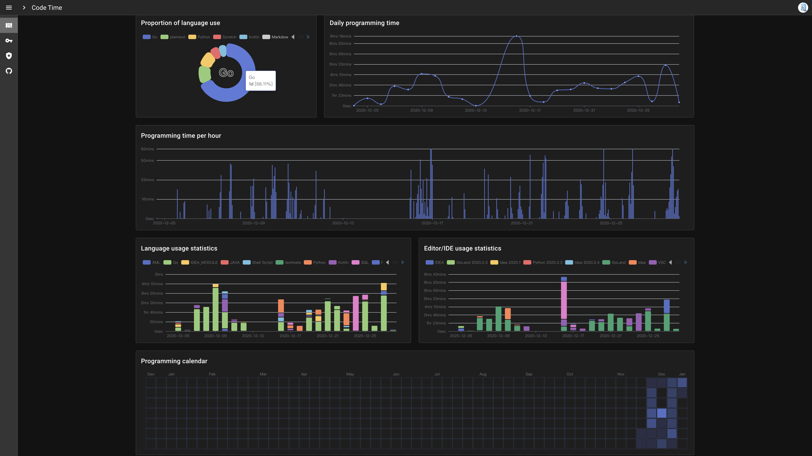

### Hey 👋, I'm si9ma

Hi there, I'm si9ma, a Software Engineering 🚀 from Beijing, China. I'm open-source development enthusiast.

- 🌱 I’m currently learning Linux Kernel, Docker and K8s;
- 🚀 I'm currently reading "Understanding the Linux Kernel, 3rd Edition";

### Stack I work with
<code></code>
<code></code>
<code></code>
<code></code>
<code></code>
<code></code>
<code></code>
<code></code>
<code></code>
<code></code>
<code></code>
<code></code>
<code></code>
<code></code>
<code></code>
<code></code>

---

### CodeTime Project
Statistical analysis of programming time @ http://codetime.datreks.com/

---

### My Contributions

